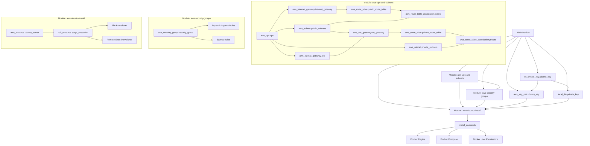

# DockerTerraform Infrastructure Diagram

The following diagram illustrates the Terraform structure and resources deployed in this project.

## Resource Deployment Overview

### Root Module Resources
- **TLS Private Key**: Creates RSA key for SSH access
- **Local File**: Saves private key to local filesystem with proper permissions
- **AWS Key Pair**: Registers the public key with AWS for EC2 instance access

### VPC and Networking (aws-vpc-and-subnets)
- **VPC**: Creates a Virtual Private Cloud with specified CIDR block
- **Public Subnets**: Creates subnets with public IP mapping across availability zones
- **Private Subnets**: Creates private subnets across availability zones
- **Internet Gateway**: Provides internet access for the VPC
- **NAT Gateway**: Allows private subnet resources to access the internet
- **Route Tables**: Configures routing for public and private subnets

### Security (aws-security-groups)
- **Security Group**: Defines inbound and outbound traffic rules
- **Ingress Rules**: Configures allowed inbound traffic (SSH, HTTP, HTTPS, Docker Swarm ports)
- **Egress Rules**: Allows all outbound traffic

### EC2 Instances (aws-ubuntu-install)
- **EC2 Instance**: Deploys Ubuntu server instances
- **Provisioners**: Configures instances with Docker using remote-exec
- **Docker Installation**: Installs Docker Engine and Docker Compose
- **User Permissions**: Configures proper Docker access permissions
